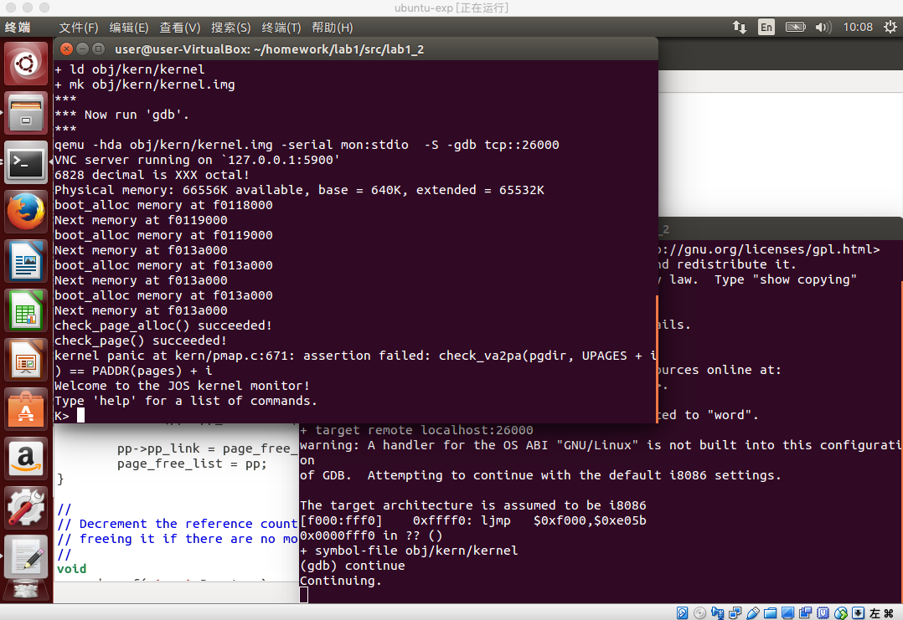
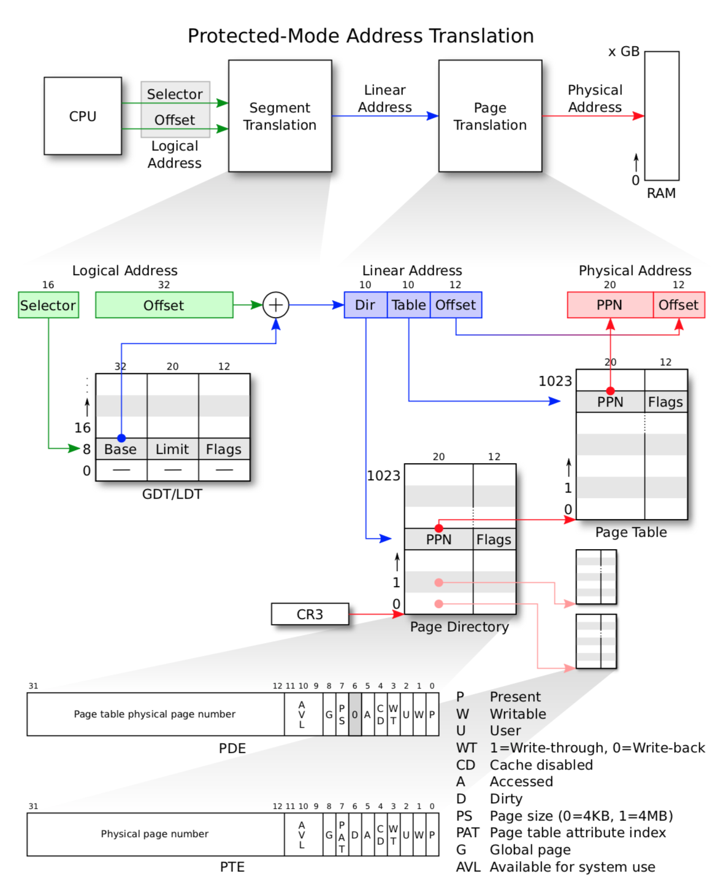
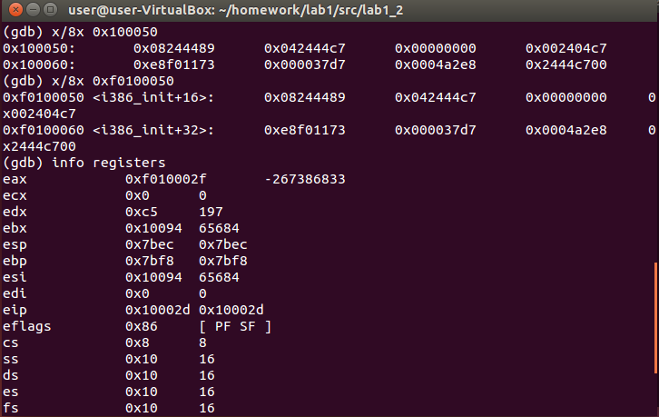

# JOS实验lab2 内存管理

[TOC]

## 零、实验要求

[Lab2实验要求](./lab2实验要求.pdf)

> **组员:    1711351 李汶蔚   1711308常欢 1711347 李瑞峰**
> 完成情况及分工：

## 一、实验简介

本次实验包含5个练习，6个问题以及4个挑战任务，实验内容主要分为两部分：

### (一)物理页面管理

**操作系统必须知道物理RAM的哪些部分是空闲的，哪些部分正在被使用。JOS以页（page)为单位管理PC的物理内存，从而可以使用MMU映射和保护每一片分配的内存。**

*任务：完成物理页分配器。它用于保存哪些页面是空闲的，在数据的组织上，由struct Page对象构成的链表，每个Page结构都对应一个物理页。在完成虚拟内存实验之前，编写物理页分配器。*

### (二)虚拟内存

**在x86术语中，虚拟地址由段选择器和段内的偏移组成。线性地址是在段转换之后，页转换之前的地址。物理地址是在段和页转换之后最终获得的最终地址，也就是最终在硬件总线上最后出现在RAM中的物理地址。**

*任务：为整个JOS设置虚拟内存布局，映射前256MB物理内存到虚拟地址0xf0000000处，并映射虚拟内存的其他区域。*

## 二、实验过程

### PART 0：预备知识

在Lab1中，我们了解的PC物理地址存储结构如下

```

+------------------+  <- 0xFFFFFFFF (4GB)
|      32-bit      |
|  memory mapped   |
|     devices      |
|                  |
/\/\/\/\/\/\/\/\/\/\

/\/\/\/\/\/\/\/\/\/\
|                  |
|      Unused      |
|                  |
+------------------+  <- depends on amount of RAM
|                  |
|                  |
| Extended Memory  |
|                  |
|                  |
+------------------+  <- 0x00100000 (1MB)
|     BIOS ROM     |
+------------------+  <- 0x000F0000 (960KB)
|  16-bit devices, |
|  expansion ROMs  |
+------------------+  <- 0x000C0000 (768KB)
|   VGA Display    |
+------------------+  <- 0x000A0000 (640KB)
|                  |
|    Low Memory    |
|                  |
+------------------+  <- 0x00000000
```

整个Lab1实验流程下来，可以更加明确（图来自[sssaltyfish的博客](https://blog.csdn.net/weixin_43344725/article/details/89175115)）


在`inc/memlayout.h`中，虚拟内存结构如下：

```cpp

/*
 * Virtual memory map:                                Permissions
 *                                                    kernel/user
 *
 *    4 Gig -------->  +------------------------------+
 *                     |                              | RW/--
 *                     ~~~~~~~~~~~~~~~~~~~~~~~~~~~~~~~~
 *                     :              .               :
 *                     :              .               :
 *                     :              .               :
 *                     |~~~~~~~~~~~~~~~~~~~~~~~~~~~~~~| RW/--
 *                     |                              | RW/--
 *                     |   Remapped Physical Memory   | RW/--
 *                     |                              | RW/--
 *    KERNBASE ----->  +------------------------------+ 0xf0000000
 *                     |       Empty Memory (*)       | --/--  PTSIZE
 *    KSTACKTOP ---->  +------------------------------+ 0xefc00000      --+
 *                     |         Kernel Stack         | RW/--  KSTKSIZE   |
 *                     | - - - - - - - - - - - - - - -|                 PTSIZE
 *                     |      Invalid Memory (*)      | --/--             |
 *    ULIM     ------> +------------------------------+ 0xef800000      --+
 *                     |  Cur. Page Table (User R-)   | R-/R-  PTSIZE
 *    UVPT      ---->  +------------------------------+ 0xef400000
 *                     |          RO PAGES            | R-/R-  PTSIZE
 *    UPAGES    ---->  +------------------------------+ 0xef000000
 *                     |           RO ENVS            | R-/R-  PTSIZE
 * UTOP,UENVS ------>  +------------------------------+ 0xeec00000
 * UXSTACKTOP -/       |     User Exception Stack     | RW/RW  PGSIZE
 *                     +------------------------------+ 0xeebff000
 *                     |       Empty Memory (*)       | --/--  PGSIZE
 *    USTACKTOP  --->  +------------------------------+ 0xeebfe000
 *                     |      Normal User Stack       | RW/RW  PGSIZE
 *                     +------------------------------+ 0xeebfd000
 *                     |                              |
 *                     |                              |
 *                     ~~~~~~~~~~~~~~~~~~~~~~~~~~~~~~~~
 *                     .                              .
 *                     .                              .
 *                     .                              .
 *                     |~~~~~~~~~~~~~~~~~~~~~~~~~~~~~~|
 *                     |     Program Data & Heap      |
 *    UTEXT -------->  +------------------------------+ 0x00800000
 *    PFTEMP ------->  |       Empty Memory (*)       |        PTSIZE
 *                     |                              |
 *    UTEMP -------->  +------------------------------+ 0x00400000      --+
 *                     |       Empty Memory (*)       |                   |
 *                     | - - - - - - - - - - - - - - -|                   |
 *                     |  User STAB Data (optional)   |                 PTSIZE
 *    USTABDATA ---->  +------------------------------+ 0x00200000        |
 *                     |       Empty Memory (*)       |                   |
 *    0 ------------>  +------------------------------+                 --+
 *
 * (*) Note: The kernel ensures that "Invalid Memory" (ULIM) is *never*
 *     mapped.  "Empty Memory" is normally unmapped, but user programs may
 *     map pages there if desired.  JOS user programs map pages temporarily
 *     at UTEMP.
 */
```

### PART 1：编写物理页分配器

**页表管理：**每个页目录表有1024个页目录项，每个页目录项占用4字节，一个页目录表占4KB内存。而每个页目录项都指向一个有1024个页表项的页表，每个页表项也占用4字节，因此JOS中页目录和页表一共要占用 1025 * 4KB = 4100KB 约4MB的内存。而通常我们说每个用户进程虚拟地址空间为4GB，其实就是每个进程都有一个页目录表，进程运行时将页目录地址装载到CR3寄存器中，从而每个进程最大可以用4GB内存。在JOS中，为了简单起见，只用了一个页目录表，整个系统的线性地址空间4GB是被内核和所有其他的用户程序所共用的。

```c++
在文件kern/pmap.c中，必须实现以下函数的代码（可能按照给定的顺序）。

boot_alloc()
mem_init()（仅完成调用check_page_free_list(1) 之前的部分）
page_init()
page_alloc()
page_free()

check_page_free_list()和check_page_alloc()会测试你的物理页面分配器。你应该启动JOS并查看check_page_alloc() 是否报告成功。修改代码，并确定能够通过它的测试。你可以添加自己的assert()来验证你的假设是否正确。
```

首先，查看pmap.c文件，发现其包含了两个很重要的头文件，分别是：`#include <inc/mmu.h>`和`#include <kern/pmap.h>`，对这两个文件进行宏观上的认识：

#### (一) <inc/mmu.h>

该文件中包含三部分：

**第一部分是页机制中32位地址的划分，最高10位作为PDX（页目录下标），接着10位作为PTX（页表下标），低10位是页偏移。**

```c++
// +--------10------+-------10-------+---------12----------+
// | Page Directory |   Page Table   | Offset within Page  |
// |      Index     |      Index     |                     |
// +----------------+----------------+---------------------+
//  \--- PDX(la) --/ \--- PTX(la) --/ \---- PGOFF(la) ----/
//  \---------- PGNUM(la) ----------/
```

**并且定义了一些常量，包括获取各个部分的偏移量、页大小、页表项的各个标志位、以及页缺失等常量。**

**第二部分是定义与段机制有关的数据结构与常量，如struct Segdesc。**

**第三部分是定义了Trap中断用到的数据结构和常量，如struct Taskstate、struct Gatedesc、struct Pseudodesc等。**

#### (二) <kern/pmap.h>

在该文件中，又引入了一个很重要的文件`#include <inc/memlayout.h>`	。

在**memlayout.h**中展示了Jos内存的存储情况即内存的布局，并定义了每个内存段的起始地址和大小，将内存分成了几个部分。

**PGSIZE：4096字节（页大小）； PTSIZE：1024 x 4096(1024个页)**;

**定义了描述物理页的数据结构：**

```c++
struct Page{
	// Next page on the free list.
	struct Page *pp_link;

	// pp_ref is the count of pointers (usually in page table entries)
	// to this page, for pages allocated using page_alloc.
	// Pages allocated at boot time using pmap.c's
	// boot_alloc do not have valid reference count fields.

	uint16_t pp_ref;
};
```

**pmap.h中除了定义了pmap.c中要完成的那几个代码之外，还定义了几个重要的内联函数（页面操作函数）：**

```c++
extern char bootstacktop[], bootstack[];

extern struct Page *pages;
extern size_t npages;

extern pde_t *kern_pgdir;

#define KADDR(pa) _kaddr(__FILE__, __LINE__, pa)//物理地址转虚拟地址
#define PADDR(kva) _paddr(__FILE__, __LINE__, kva)//虚拟地址转物理地址
static inline physaddr_t
page2pa(struct Page *pp) //得到该 Page结构对应的物理页帧
{
	return (pp - pages) << PGSHIFT; //PGSHIFT = 12 ; 2^12 = 4096字节
}
```

```c++
static inline struct Page*
pa2page(physaddr_t pa) //// 由物理地址得到Page结构体
{
	if (PGNUM(pa) >= npages)
		panic("pa2page called with invalid pa");
	return &pages[PGNUM(pa)];
}
```

```c++
static inline void* 
page2kva(struct Page *pp)// 返回Page结构pp所对应的物理页面的虚拟地址
{
	return KADDR(page2pa(pp));
}
```

#### (三）练习解答

**至此，我们知道内存管理分配需要的数据结构和函数已定义完成，我们分析pmap.c这个文件，并完成练习一，代码如下。**

```c++
//pmap.c
// These variables are set by i386_detect_memory()
size_t npages;			// Amount of physical memory (in pages)
static size_t npages_basemem;	// Amount of base memory (in pages)

// These variables are set in mem_init()
pde_t *kern_pgdir;		// Kernel's initial page directory
struct Page *pages;		// Physical page state array
static struct Page *page_free_list;	// Free list of physical pages
```

1. boot_alloc() 

   ```c++
   // 字节单位申请内存，page_alloc()实现后便不再用。
   static void *
   boot_alloc(uint32_t n)
   {
       static char *nextfree;  // virtual address of next byte of free memory
       char *result;
    
       // Initialize nextfree if this is the first time.
       // 'end' is a magic symbol automatically generated by the linker,
       // which points to the end of the kernel's bss segment:
       // the first virtual address that the linker did *not* assign
       // to any kernel code or global variables.
       if (!nextfree) {
           extern char end[];
           nextfree = ROUNDUP((char *) end, PGSIZE);
       }
    
       // Allocate a chunk large enough to hold 'n' bytes, then update
       // nextfree.  Make sure nextfree is kept aligned
       // to a multiple of PGSIZE.
       //
       // LAB 2: Your code here.
       if (n == 0) {
           return nextfree;
       }
       result = nextfree;
       nextfree += ROUNDUP(n, PGSIZE);
       return result;
   }
   ```
   1. 如果尚未初始化nextfree，则执行第一个if，简单来说，就是linker生成end变量后，先把第一块虚拟地址分给这个虚拟地址指向的bss segment（BSS是存放程序中未初始化的全局变量的一块静态内存分配区域），而且这一块虚拟地址linker不会分配给其他任何人。再简单一点，就是对齐。
   
   2. n是分配n个byte，意思就是现在要分配n个byte，占用n个byte。
   
   3. end是指向内核的 bss 段的末尾的一个指针。进入 $ROOT/obj/kern 目录，键入objdump -h kernel，查看文件结构可以发现，bss已经位于内核最终。我们知道kernel是最后一个被放入的，所以，end是向内核的 bss 段的末尾的一个指针，也就是第一个未使用的虚拟内存地址。
   
   4. 关于ROUNDUP函数：进入 $ROOT/inc 目录下的 types.h 可以看到ROUNDUP的原定义。
   
      ```c++
      // Round up to the nearest multiple of n
      #define ROUNDUP(a, n)                                           
      ({                                                              
              uint32_t __n = (uint32_t) (n);                          
              (typeof(a)) (ROUNDDOWN((uint32_t) (a) + __n - 1, __n)); 
      })
      ```
   
   5. 关于添加的代码就很容易了，根据参数进行对齐即可。
   
      + 如果n=0的话，就直接返回nextfree
      + 如果n!=0，就result，nextfree要考虑加上字节且以PAGESZIE大小对齐，也就是指向下一处空闲的页面。
   
2. mem_init()

```c++
//内存功能初始化
pages = (struct Page*)boot_alloc(npages * sizeof(struct Page));//分配npages个页*Page结构体大小个字节的空间,即一个长度为npages的数组
memset(pages, 0, npages * sizeof(struct Page));//初始化为0
```

Page结构之前已经展示，由两部分组成：

+ pp_link:指向下一个空闲的⻚。 
+ pp_ref:这是指向该⻚的指针数量。

其中，分配二级页表的代码已经给出

```c++
kern_pgdir = (pde_t *) boot_alloc(PGSIZE);
memset(kern_pgdir, 0, PGSIZE);
```

所以不难模仿着写出分配npages的代码。

3. page_init()

```c++
//初始化物理页框表，这个就按照注释的提示，结合物理内存的布局，维护pages数组即可
// However this is not truly the case.  What memory is free?
	//  1) Mark physical page 0 as in use.
	//     This way we preserve the real-mode IDT and BIOS structures
	//     in case we ever need them.  (Currently we don't, but...)
	pages[0].pp_ref = 1; //为1代表该页被占用
	//  2) The rest of base memory, [PGSIZE, npages_basemem * PGSIZE)
	//     is free.
	size_t i;	//page_free_list指向最后一个分配的页,pp_link指向前一个空闲页
	//把所有空闲页串起来
	for (i = 1; i < npages_basemem; i++) {
		pages[i].pp_ref = 0;
		pages[i].pp_link = page_free_list;
		page_free_list = &pages[i];
	}
	//  3) Then comes the IO hole [IOPHYSMEM, EXTPHYSMEM), which must
	//     never be allocated.
	for(i = IOPHYSMEM / PGSIZE; i < EXTPHYSMEM/PGSIZE;i++)
	{
		pages[i].pp_ref = 1;
	}
	//  4) Then extended memory [EXTPHYSMEM, ...).
	//     Some of it is in use, some is free. Where is the kernel
	//     in physical memory?  Which pages are already in use for
	//     page tables and other data structures?

	size_t first_free_paddr = PADDR(boot_alloc(0)); 
//这个是一个转换，传入0就能得到next_free的值，即扩展内存部分可用物理内存的首地址，从EXTPHYSMEM到该地址均被kernel占用
	for(i = EXTPHYSMEM / PGSIZE; i < first_free_paddr / PGSIZE;i++)
	{
		pages[i].pp_ref = 1;
	}

	for(i = first_free_paddr / PGSIZE; i < npages; i++) //这是剩余可用的扩展内存
	{
		pages[i].pp_ref = 0;
		pages[i].pp_link = page_free_list;
		page_free_list = &pages[i];
	}
```

代码更改要求如下：

1. 给0⻚面标记为正在使用的状态。
2. 剩下的基础内存是空闲的。
3. IO洞 不能被分配。
4. 扩展内存有些被用，有些空闲。

解答在注释中。

**tips：如果需要物理地址转虚拟地址可以通过 ** KADDR(physical_address)**，虚拟地址转物理地址可以通用**PADDR(virtual_address)**。**

4. page_alloc()

```c++
//物理页分配，维护page_free_list即可
if (page_free_list) 
	{
		struct Page *temp = page_free_list;
		page_free_list = page_free_list->pp_link;
		if (alloc_flags & ALLOC_ZERO) 
			memset(page2kva(temp), 0, PGSIZE);
		return temp;
	}
	return NULL;
```

5. page_free()
   + 如果pp->pp_ref不为0说明这个⻚面不是空的，如果pp->pp_link不为NULL说明接下来链表还有空⻚面，这些都是不可以free的。
   +  如果排除以上条件，那么就可以free，free的步骤就是把pp_link从以前的NULL变成现在下一个可用⻚面，也就是page_free_list。

```c++
//物理页释放
// Fill this function in
	assert(pp->pp_ref == 0 || pp->pp_link == NULL);

	pp->pp_link = page_free_list;
	page_free_list = pp;
```




**关于EXercise1的一点总结：**

1. 在boot_alloc()函数处迷惑了很长时间：为什么其中会出现虚拟地址？

   答：实际上，该函数的参数和返回值都是虚拟地址，之后当我们需要物理地址时，我们是用PADDR(virtual_address)转换对应的物理地址的，所以在物理页分配部分，也不是一定要全部用物理地址。

   而且，一旦我们处于保护模式（也就是我们在进入boot/boot.S中做的第一件事），就没有办法直接使用线性或物理地址。所有存储器引用被理解为虚拟地址并由MMU转换，这意味着C中的所有指针都是虚拟地址。

2. **这句话在之后的实验中提到，但我觉得物理页分配这里明显就需要提示了ε＝ε＝ε＝(#>д<)ﾉ**

   > JOS内核有时还需要能够根据虚拟地址找到相应的物理地址。内核的全局变量以及使用 boot_alloc()分配的内存，都在内核加载的区域中，即从0xf0000000开始的区域，也就是我们映射了所有物理内存的区域。因此，要将该区域中的虚拟地址转换为物理地址，内核可以简单地减去0xf0000000。你可以用PADDR(va) 来完成这个减法。


### PART 2：虚拟内存

#### (1)虚拟地址、线性地址、物理地址

在x86术语中，虚拟地址由段选择器和段内的偏移组成。线性地址是在段转换之后，页转换之前的地址。*物理地址*是在段和页转换之后最终获得的最终地址。

#### (2)内存管理方案

内存管理的方案有**页式存储管理方案、段式存储管理方案、段页式存储管理方案**。

页存储是从物理内存分配的角度对物理内存的划分，而段存储则是从程序本身的角度对内存进行划分，页存储会产生许多内存碎片，比如某个进程需要`5`页加一条指令，我们就需要分配`6`页给这个进程。

段式存储是按程序自身的逻辑关系划分为若干个程序段，每个段都有一个段名 ，内存空间被动态划分为若干长度不相同的区域，称为物理段，每个物理段由起始地址和长度确定。和页机制类似，cpu取到逻辑地址，用段号查段表，得到该段在内存的起始地址，与段内偏移地址计算出物理地址。

段页式存储综合页式、段式方案的优点，克服二者的缺点，将用户进程按段划分，内存按照页进行划分，以页为单位进行分配，逻辑地址划分为：[段号|页号|页内地址]。

```c++
           Selector  +--------------+         +-----------+
          ---------->|              |         |           |
                     | Segmentation |         |  Paging   |
Software             |              |-------->|           |---------->  RAM
            Offset   |  Mechanism   |         | Mechanism |
          ---------->|              |         |           |
                     +--------------+         +-----------+
            Virtual(Logical)                   Linear                Physical
```



在本次实验的boot/boot.S中，加载了一个全局描述符表（GDT），通过将所有段基地址设置为0并将其有效地址上限设置为0xffffffff，覆盖了整个32位的地址空间。因此，“段选择器”是不起作用的，线性地址总是等于虚拟地址，只需要关注页转换。


#### (3)页表管理

现在，你将编写一组程序来管理页表：插入和删除线性到物理映射，并在需要时创建新的页以存储页表。

**练习4.** 在文件kern / pmap.c中，必须实现以下函数的代码。

```
pgdir_walk（）

boot_map_region（）

page_lookup（）

page_remove（）

page_insert（）
```

check_page()（由mem_init()调用）可以用于测试你的页表管理程序。你应该确保测试报告成功之后再继续后面的实验。

------

该练习中的函数是都是有关于虚拟地址和物理地址转换的

**`pmap.h`中有以下函数**

```c++
static inline physaddr_t
page2pa(struct Page *pp)
{
	return (pp - pages) << PGSHIFT;
}

static inline struct Page*
pa2page(physaddr_t pa)
{
	if (PGNUM(pa) >= npages)
		panic("pa2page called with invalid pa");
	return &pages[PGNUM(pa)];
}

static inline void*
page2kva(struct Page *pp)
{
	return KADDR(page2pa(pp));
}
```

+ page2pa(*Page) 是得到参数Page对应物理内存的起始位置
+ pa2page(physaddr_t)是由一个物理地址得到对应的Page
+ page2kva(*Page)是获得一个Page对应的虚拟内核地址的

**`mmu.h`中有一下宏定义:**（之后会用到）（段页机制的图中展示的更好）

```c
#define PTE_P		0x001	// Present
#define PTE_W		0x002	// Writeable
#define PTE_U		0x004	// User
#define PTE_PWT		0x008	// Write-Through
#define PTE_PCD		0x010	// Cache-Disable
#define PTE_A		0x020	// Accessed
#define PTE_D		0x040	// Dirty
#define PTE_PS		0x080	// Page Size
#define PTE_G		0x100	// Global
```

（存在，可写，用户，不允许缓存，可达，脏读，页面大小，是否全局等）

1. pgdir_walk（）

   **给定一个页目录表指针 pgdir ，该函数应该返回线性地址va所对应的页表项指针。**

   

   注释中提到的[mmu.h](####(一) <inc/mmu.h>)在此

   按照注释中所写，整个程序的步骤如下：

   当页目录索引内不存在 va 对应的表项时，即虚拟地址没有对应的物理地址，需要根据create判断是否要为其分配一个物理页面用作二级页表，这里需要设置权限，由于一级页表和二级页表都有权限控制，所以一般的做法是，放宽一级页表的权限，主要由二级页表来控制权限，在提示2中写道，要注意去掉页目录索引（PDX）和页表索引（PTX）的权限位以保证安全操作。

   当页目录索引内存在 va 对应的表项时，即虚拟地址有对应的物理地址，该页面的指针数量应该加一，页面清空，并返回一个新页表页的指针。

    ```c
   pte_t *
   pgdir_walk(pde_t *pgdir, const void *va, int create)
   {
           // 取得虚拟地址的页目录项 PDX(va), 并得到物理地址中所对应的页目录，命名为 pde
     			//pgdir是一个指向page directory的指针
           pde_t pde = pgdir[PDX(va)];
           // 如果该物理页面 pde 不存在
           if (!(pde & PTE_P)){
             // pde 不存在且不允许创建
               if (!create)
                   return NULL;
               // pde 不存在且允许创建
               else {
                   // 新建页面 pp
                   struct Page *pp = page_alloc(true);
                   // 如果新建页面失败
                   if (!pp)
                       return NULL;
                   // 新建页面的指针数量增长1
                   (pp->pp_ref)++;
                   // 新建页面取消限制权限
                   pgdir[PDX(va)] = page2pa(pp) | PTE_U | PTE_P | PTE_W;
                   // 取得虚拟地址的页表项 PTX(va)，并找到新建页面所对应的地址
                   return (pte_t *) page2kva(pp) + PTX(va);
               }
           }
           // 如果该页目录的物理地址pde存在，说明该地址已分配，则返回已分配过的地址
           return (pte_t *) KADDR(PTE_ADDR(pde)) + PTX(va);
   }
    ```

   注解：

   ```c
   // Address in page table or page directory entry
   #define PTE_ADDR(pte)	((physaddr_t) (pte) & ~0xFFF)
   
   // page directory index
   #define PDX(la)		((((uintptr_t) (la)) >> PDXSHIFT) & 0x3FF)
   
   // page table index
   #define PTX(la)		((((uintptr_t) (la)) >> PTXSHIFT) & 0x3FF)
   ```

2. boot_map_region（）

    ```c++
   //建立虚拟地址空间到物理地址空间的映射
   static void
   boot_map_region(pde_t *pgdir, uintptr_t va, size_t size, physaddr_t pa, int perm)
   {
   	// Fill this function in
   	int i;
   	for (i = 0; i < size/PGSIZE; ++i, va += PGSIZE, pa += PGSIZE) {
   		pte_t *pte = pgdir_walk(pgdir, (void *) va, 1);	//create
   		if (!pte) 
         panic("boot_map_region panic, out of memory");
   		*pte = pa | perm | PTE_P;
   	}
   }
     
    ```

3. page_lookup（）

   返回虚拟地址va所映射的物理页的Page结构体的指针，如果pte_store参数不为0，则把这个物理页的页表项地址存放在pte_store中。

   ```c
   //
   // Return the page mapped at virtual address 'va'.
   // If pte_store is not zero, then we store in it the address
   // of the pte for this page.  This is used by page_remove and
   // can be used to verify page permissions for syscall arguments,
   // but should not be used by most callers.
   //
   // Return NULL if there is no page mapped at va.
   //
   // Hint: the TA solution uses pgdir_walk and pa2page.
   //
   struct Page *
   page_lookup(pde_t *pgdir, void *va, pte_t **pte_store)
   {
           // Fill this function in
           pte_t *pte = pgdir_walk(pgdir,va,0);
           if (!pte || !(*pte & PTE_P))
               return NULL;
           if (pte_store != 0)
               *pte_store = pte;
           return pa2page(PTE_ADDR(*pte));
   }
   ```

   这个函数的功能就很容易实现了，我们只需要调用pgdir_walk函数获取这个va对应的页表项，然后判断这个页是否已经在内存中，如果在则返回这个页的Page结构体指针。并且把这个页表项的内容存放到pte_store中。

4. page_remove（）

    ```c++
   void
   page_remove(pde_t *pgdir, void *va)
   {
   	// Fill this function in
   	pte_t *pte;
   	struct Page *pg = page_lookup(pgdir, va, &pte);
   	if (!pg || !(*pte & PTE_P))
       return;	//page not exist
   //   - The ref count on the physical page should decrement.
   //   - The physical page should be freed if the refcount reaches 0.
   	page_decref(pg);
   //   - The pg table entry corresponding to 'va' should be set to 0.
   	*pte = 0;
   //   - The TLB must be invalidated if you remove an entry from
   //     the page table.
   	tlb_invalidate(pgdir, va);
   }
    ```

5. page_insert（）

   功能上是完成：把一个物理内存中页pp与虚拟地址va建立映射关系。

   这个函数的主要步骤如下：

   1. 首先通过pgdir_walk函数求出虚拟地址va所对应的页表项。
   2. 修改pp_ref的值。
   3. 查看这个页表项，确定va是否已经被映射，如果被映射，则删除这个映射。(9-13)
   4. 把va和pp之间的映射关系加入到页表项中。(14-15)

   ```c
   int
   page_insert(pde_t *pgdir, struct PageInfo *pp, void *va, int perm)
   {
           // Fill this function in
           pte_t *pte = pgdir_walk(pgdir,va,1);
           if (!pte)
               return -E_NO_MEM;
           // 如果 va 对应的页面存在
           if (*pte & PTE_P) {
               if (PTE_ADDR(*pte) == page2pa(pp)){
                   *pte = page2pa(pp)|perm|PTE_P;
                   return 0;
               }
               page_remove(pgdir, va);
           }
           // 如果 va 对应的页面不存在
           (pp->pp_ref)++;
           *pte = page2pa(pp)|perm|PTE_P;
           return 0;
   }
   ```


#### (4)练习和问题解答

**练习2.**

> 请参阅“ [Intel 80386参考手册”的](http://oslab.mobisys.cc/pdos.csail.mit.edu/6.828/2014/readings/i386/toc.htm)第5章和第6章 。仔细阅读有关页转换和基于页的保护部分（5.2和6.4）。我们建议你同时浏览有关分段的部分; 虽然JOS使用的分页机制实现的虚拟内存和保护，但是段转换和段保护功能无法在x86上禁用，因此你需要对其有基本的了解。

**练习3.** 

> 虽然GDB只能通过虚拟地址访问QEMU的内存，但在设置虚拟内存的同时，查看物理内存通常很有用。从实验室工具指南里查看QEMU [监视器命令](http://oslab.mobisys.cc/pdos.csail.mit.edu/6.828/2014/labguide.html#qemu)，特别注意 `xp`命令，它可以让你查看物理内存的内容。要调用QEMU监视器，请在终端中下 **Ctrl-a c**（注：这个表示先同时按下ctrl和a，然后再按下c）
>
> 使用QEMU监视器中**xp**命令和GDB中的的**x**命令查看相应物理地址和虚拟地址上内存的内容，并确保看到相同的数据.
>
> 我们修补的QEMU版本提供了一个**info pg** 的命令：它显示了当前页表的详细的表示，包括所有映射的内存范围，权限和标志。QEMU中原来还提供了一个**info mem**命令，显示虚拟内存的映射范围以及配置了哪些权限。



**问题1**

**1.假设以下JOS内核代码是正确的，变量x应该是什么类型，uintptr_t还是 physaddr_t？**

```c++
  *mystery_t* x;

  char * value = return_a_pointer（）;

  \* value = 10;

  x =（*mystery_t*）value;
```

必然是uintptr_t，因为内核中的数据操作都是以内核虚拟地址进行。

> 一旦我们处于保护模式（也就是我们在进入boot/boot.S中做的第一件事），就没有办法直接使用线性或物理地址。所有存储器引用被理解为虚拟地址并由MMU转换，这意味着C中的所有指针都是虚拟地址。

### PART 3 内核地址空间

## 三、问题讨论


[参考标识符]: 
[标识符]: 